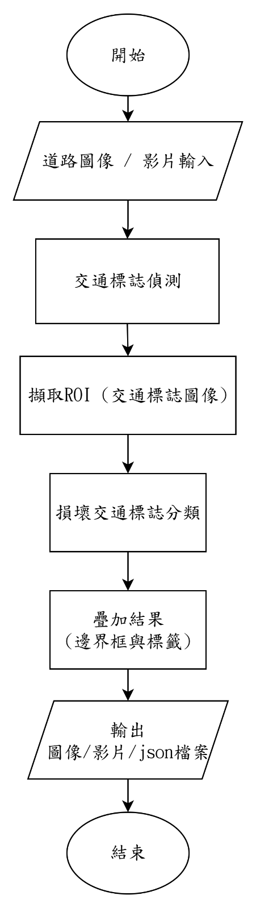
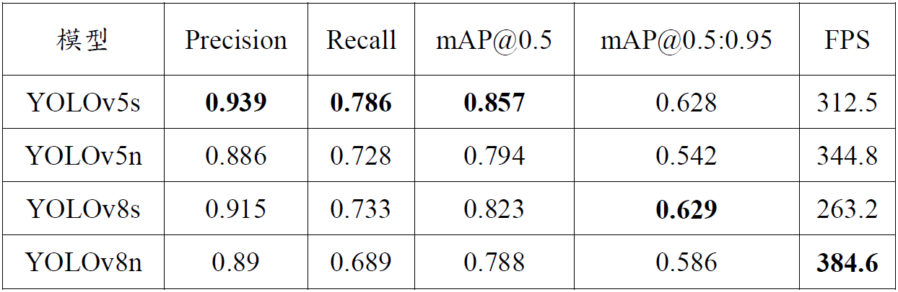
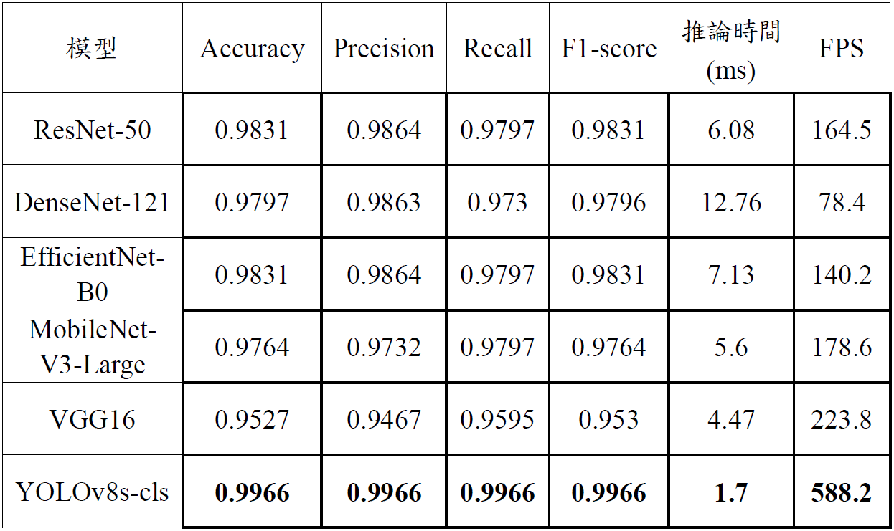
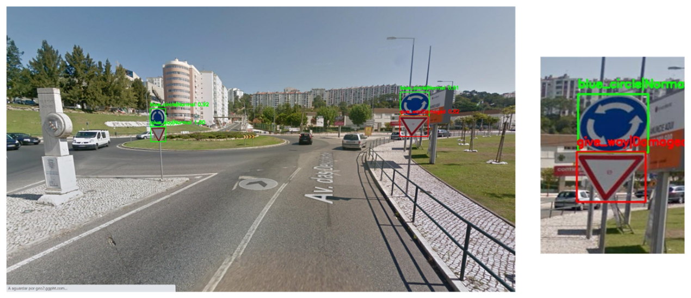
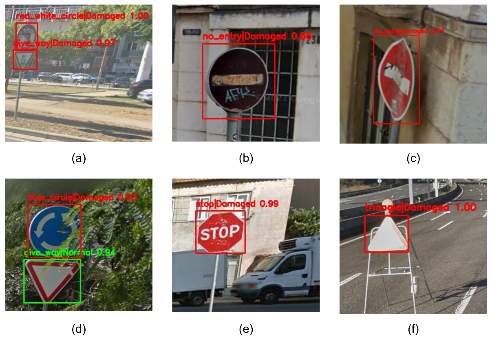

# 🚧 Damaged Traffic Signs Detection System

An end-to-end AI system for detecting traffic signs and classifying whether they are damaged or normal.  
This project integrates **image classification**, **object detection**, and a **two-stage pipeline** to simulate a real-world intelligent inspection system.

---

## 📖 Project Overview

In real-world scenarios, damaged traffic signs can lead to safety issues and incorrect navigation.  
This project aims to build an automated system that can:

- 📍 Detect traffic signs in images
- 🔍 Identify whether each sign is damaged or normal
- ⚙️ Combine detection and classification into a complete pipeline

---

## System Architecture
<p align="center">
  
</p>

This **two-stage pipeline** improves classification accuracy by focusing only on detected regions.

---

## 🔬 Methodology

### 1️⃣ Image Classification (Damaged vs Normal)

Trained and compared multiple CNN architectures:

- ResNet50
- DenseNet121
- EfficientNet-B0
- MobileNetV3-Large
- VGG16

Dataset structure:

train / val / test
├── damaged
└── normal

Outputs:
- Best model weights (`.pth`)
- Training results (`.json`)

---

### 2️⃣ YOLOv8 Classification (Lightweight Baseline)

- Model: YOLOv8-cls (yolov8n)
- Purpose:
  - Compare CNN vs YOLO classification performance
  - Evaluate speed vs accuracy trade-off

Outputs:
- Confusion Matrix
- Training curves
- Prediction visualizations

---

### 3️⃣ Object Detection

Trained multiple detection models:

- YOLOv5 (n / s)
- YOLOv8 (n / s)

Evaluation metrics:

- Precision-Recall Curve
- F1 Score
- Confusion Matrix
- mAP (mean Average Precision)

---

### 4️⃣ Two-Stage Detection + Classification Pipeline

Implemented in:

mix/det_cls.py

Pipeline steps:

1. Detect traffic signs using YOLO
2. Crop bounding boxes
3. Classify each cropped image
4. Output final damaged/normal result

---

## 📊 Results

- Best Classification Accuracy: 99.6%
- Best Detection mAP: 0.857
- Best Overall Pipeline Performance: 94%

### 🔹 Detection Results

<p align="center">
  
</p>

---

### 🔹 Classification Results

<p align="center">
  
</p>

---

### 🔹 Final Pipeline Output (Detection + Classification)




---


## 📂 Project Structure

```
├── classification
│ ├── all # CNN training
│ ├── data # dataset
│ └── yolov8-cls # YOLO classification
│
├── detection
│ ├── yolov5 # YOLOv5 experiments
│ ├── yolov8 # YOLOv8 experiments
│ └── data / labels
│
└── mix
└── det_cls.py # detection + classification pipeline
```

---

## Environment

- Windows 10
- Python 3.9.17
- PyTorch 2.0.1+cu118
- Ultralytics YOLOv5 / YOLOv8

## Key Contributions
- ✅ Multi-model comparison (ResNet-50, DenseNet-121, EfficientNet-B0, MobileNetV3-Large, VGG-16 and YOLOv8s-cls)
- ✅ YOLOv5 vs YOLOv8 benchmarking
- ✅ Two-stage detection-classification pipeline, output detecting pictures and json files